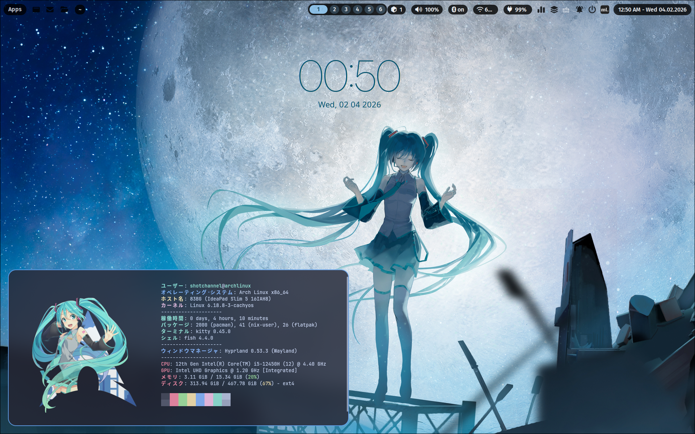

## archlinux-dotfiles
<div align="center">
  


*Background image: Drawn by [Konya Karasue](https://www.pixiv.net/en/users/10109777).*


</div>

> *Mou ikkai, mou ikkai.*

This is my dotfiles for my current Arch Linux setup.\
I will throw random things here for backup (I seriously took a lesson from the latest Fedora incident, if you know you know >x&lt;).

**Some of these dotfiles were created by me, some were inspired by others, and some are modifications of existing works. All are distributed under the MIT License.**

```
sudo pacman -Syu && yay && flatpak upgrade
```

Always run this once a day & every time you're gonna install something!


<div align="center">


# STATS?


</div>
