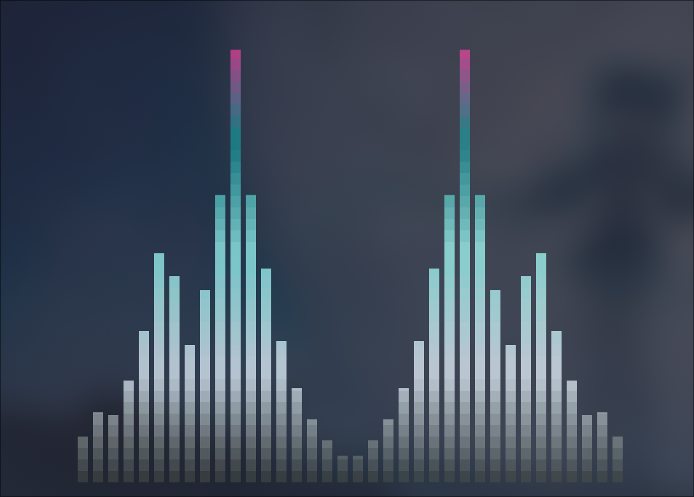

# INSTALLATION AND CONFIGURATION GUIDE FOR CAVA


<br>

<div align="center">




</div>

<br>

### 1. Fully upgrade the system (recommended)

```
sudo pacman -Syu && yay && flatpak upgrade
```

### 2. Install cava
*[The cava project](https://github.com/karlstav/cava)*

<br>

> **Option 1: Through the official Arch Linux repository**

```
sudo pacman -S fastfetch
```

> **Option 2: Manually build the package from source**

```
git clone https://github.com/karlstav/cava.git
cd cava
./autogen.sh
./configure
make
make install
```

### 3. Clone this repository (skip if already done)

```
git clone https://github.com/ShotChannel/archlinux-dotfiles.git
```

### 4. Navigate to the cloned repository's directory, copy the files to the `.config` directory

```
cd archlinux-dotfiles
cd dotfiles
sudo cp cava/* ~/.config/cava
```

### 5. Run cava

```
cava
```
<br>
Andddd it should be done! This is a simple Hatsune Miku theme cava, made by me :))

<br>


> [!NOTE]
> If you run cava and show this error: `window is too narrow for number of bars set, maximum is ...`, edit `~/.config/cava/config` and change the number of bars (in the `[general]` section) to lower than 36! 36, you get it... Funny number... 36... Ha.. ha...
