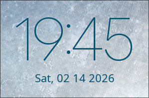

# INSTALLATION AND CONFIGURATION GUIDE FOR EWW


<br>

<div align="center">



*Clock 1*


</div>

<br>

### 1. Fully upgrade the system (recommended)

```
sudo pacman -Syu && yay && flatpak upgrade
```

### 2. Install eww
*[The eww project](https://github.com/elkowar/eww)*

<br>

> **Option 1: Through the AUR helper**

```
yay -S eww
```

> **Option 2: Manually build the package**

```
git clone https://aur.archlinux.org/eww.git
cd eww
makepkg -si
```

### 3. Git clone this repository (skip if already done)

```
git clone https://github.com/ShotChannel/archlinux-dotfiles.git
```

### 4. Navigate to the cloned repository's directory, copy the files to the `.config` directory

```
cd archlinux-dotfiles
cd dotfiles
sudo cp eww/* ~/.config/eww
```

### 5. Reload eww

```
eww close clock
eww reload
```
<br>
Andddd it should be done! This is a simple clock, made from eww, config made by me :))
